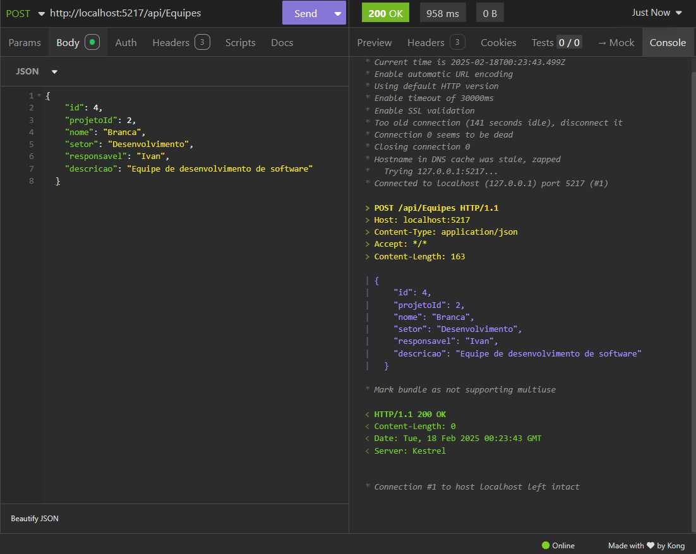

# Desafio em C#

Neste desafio criei uma API utilizando ASP.NET Core Web API, Entity Framework Core (Code First e Migrations) e banco de dados SQL Server.

Para configurar o banco de dados, vá ao arquivo "appsettings.json" e modifique a "DefaultConnection" dentro da "ConnectionStrings".
Segue um modelo de exemplo:
"Server=SEU_SERVIDOR;Database=SEU_BANCO;Trusted_Connection=True;"

Com todas as dependências devidamente instaladas, execute o projeto no botão de play da aba superior do Visual Studio.

O Swagger vai ser exibido no navegador com caminhos testaveis para a API.

Post em Equipes via Insomnia:

Get em Equipes via Insomnia:

Put em Usuarios via Insomnia:

Delete em Usuarios via Insomnia:

Post em Projetos via Swagger:

Put em Projetos via Swagger:

Get em Projetos via Swagger:

Delete em Projetos via Swagger:

Post em Tarefas via Swagger:

Put em Tarefas via Swagger:

Get em Tarefas via Swagger:

Delete em Tarefas via Swagger:

